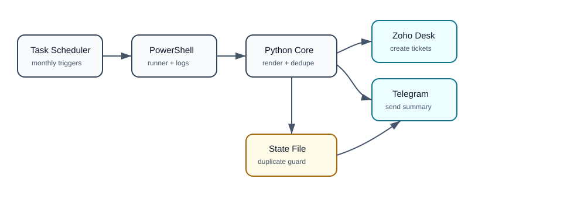

# Zoho Desk Monthly Ticket Automation

Create recurring Zoho Desk tickets on monthly dates, prevent duplicates, and send a Telegram summary when tickets are created.

This project is built for finance, operations, compliance, and support teams that repeat the same monthly ticket requests: reconciliation data, invoices, settlement reports, tax inputs, MIS packs, or close activities.



## What It Does

- Creates Zoho Desk tickets from a JSON configuration.
- Supports multiple monthly run days, for example day 1, day 3, and day 7.
- Uses template fields like `{last_month_name}`, `{last_month_year}`, and `{tat_date}`.
- Writes a local state file after each successful ticket so reruns do not duplicate tickets.
- Sends a Telegram summary only when new tickets are created.
- Runs manually, from Windows Task Scheduler, or from any scheduler that can execute PowerShell/Python.

## Flow

```text
Windows Task Scheduler
        |
        v
run_zoho_monthly_tickets.ps1
        |
        v
zoho_monthly_tickets.py
        |
        +--> read .env
        +--> read tickets.config.json
        +--> check .zoho_monthly_tickets_state.json
        +--> create tickets in Zoho Desk
        +--> notify Telegram
```

More diagram sources are in [`docs/diagrams`](docs/diagrams):

- PlantUML architecture: [`architecture.puml`](docs/diagrams/architecture.puml)
- PlantUML OAuth sequence: [`oauth-sequence.puml`](docs/diagrams/oauth-sequence.puml)
- Graphviz scheduler flow: [`scheduler-flow.dot`](docs/diagrams/scheduler-flow.dot)
- D2 duplicate-safety flow: [`duplicate-safety.d2`](docs/diagrams/duplicate-safety.d2)
- ASCII monthly timeline: [`monthly-timeline.txt`](docs/diagrams/monthly-timeline.txt)
- SVG overview: [`system-overview.svg`](docs/diagrams/system-overview.svg)

No Mermaid diagrams are used.

## Repository Safety

This public repo intentionally excludes:

- `.env`
- `tickets.config.json`
- `.zoho_monthly_tickets_state.json`
- logs
- output files
- temporary files
- installed dependency folders

Use the included examples as templates and keep real credentials out of Git.

## Requirements

- Windows 10/11 for the included Task Scheduler installer
- Python 3.10+
- A Zoho Desk OAuth client with ticket creation permission
- A Telegram bot and chat ID if you want Telegram notifications

The runtime uses only Python standard library modules.

## Setup

1. Clone the repo.

   ```powershell
   git clone https://github.com/himanshusharma75035-sudo/zoho-desk-monthly-ticket-automation.git
   cd zoho-desk-monthly-ticket-automation
   ```

2. Create your private environment file.

   ```powershell
   Copy-Item .env.example .env
   ```

3. Fill `.env`.

   ```text
   ZOHO_CLIENT_ID=...
   ZOHO_CLIENT_SECRET=...
   ZOHO_REFRESH_TOKEN=...
   ZOHO_ORG_ID=...
   TELEGRAM_BOT_TOKEN=...
   TELEGRAM_CHAT_ID=...
   ```

4. Create your private ticket config.

   ```powershell
   Copy-Item tickets.config.example.json tickets.config.json
   ```

5. Edit `tickets.config.json` with your department, requester, assignee, subject, description, and schedule fields.

## Ticket Config

Each ticket supports:

- `ticket_key`: stable internal key for duplicate protection.
- `run_day_of_month`: monthly day when the ticket becomes due.
- `subject` or `subject_template`.
- `description` or `description_template`.
- `departmentId`.
- `contactId` or `email`.
- Optional `assigneeId`, `priority`, `cf`, and any Zoho Desk ticket payload field.
- Optional `tat_day_of_current_month` for rendering `{tat_date}`.

Available template variables:

| Variable | Example |
|---|---|
| `{current_month_name}` | September |
| `{current_year}` | 2026 |
| `{current_year_short}` | 26 |
| `{last_month_name}` | August |
| `{last_month_year}` | 2026 |
| `{last_month_year_short}` | 26 |
| `{tat_date}` | 2026-09-04 |

## Test Locally

Dry run without creating tickets:

```powershell
python .\zoho_monthly_tickets.py --dry-run
```

Simulate a specific date:

```powershell
python .\zoho_monthly_tickets.py --dry-run --today 2026-09-03
```

Run unit tests:

```powershell
python -m unittest discover -s tests
```

Run for real:

```powershell
python .\zoho_monthly_tickets.py
```

## Install Windows Scheduled Task

The installer creates a hidden Windows task named `Zoho Desk Monthly Tickets`.

Default schedule:

- Day 1 at 11:00
- Day 3 at 10:00
- Day 7 at 15:00

Install:

```powershell
powershell.exe -NoProfile -ExecutionPolicy Bypass -File .\install_monthly_task.ps1
```

Customize times:

```powershell
powershell.exe -NoProfile -ExecutionPolicy Bypass -File .\install_monthly_task.ps1 -FirstDayTime "11:00" -ThirdDayTime "10:00" -SeventhDayTime "15:00"
```

Run the scheduled task manually:

```powershell
Start-ScheduledTask -TaskName "Zoho Desk Monthly Tickets"
```

Check status:

```powershell
Get-ScheduledTaskInfo -TaskName "Zoho Desk Monthly Tickets"
```

## Duplicate Safety

```text
ticket_key + month -> hash -> state key

If state has key:
  skip ticket

If state does not have key:
  create ticket
  immediately write state
```

This lets the scheduler run late or be triggered manually without creating duplicates. If the machine was off on day 1 and starts on day 3, the script catches up on all due tickets whose `run_day_of_month` is less than or equal to today and not yet recorded.

## Zoho OAuth Notes

You need a Zoho OAuth refresh token. The OAuth client must include a scope that allows ticket creation, for example:

```text
Desk.tickets.CREATE
```

If your Zoho account is not in the India data center, update these values in `.env`:

```text
ZOHO_ACCOUNTS_BASE=https://accounts.zoho.com
ZOHO_DESK_API_BASE=https://desk.zoho.com/api/v1
```

## Telegram Notes

Create a Telegram bot using BotFather, send one message to the bot, then use Telegram's `getUpdates` endpoint or another trusted method to find your `TELEGRAM_CHAT_ID`.

## Project Layout

```text
.
|-- zoho_monthly_tickets.py
|-- run_zoho_monthly_tickets.ps1
|-- install_monthly_task.ps1
|-- .env.example
|-- tickets.config.example.json
|-- tests/
|-- docs/
|   `-- diagrams/
`-- README.md
```

## License

MIT

